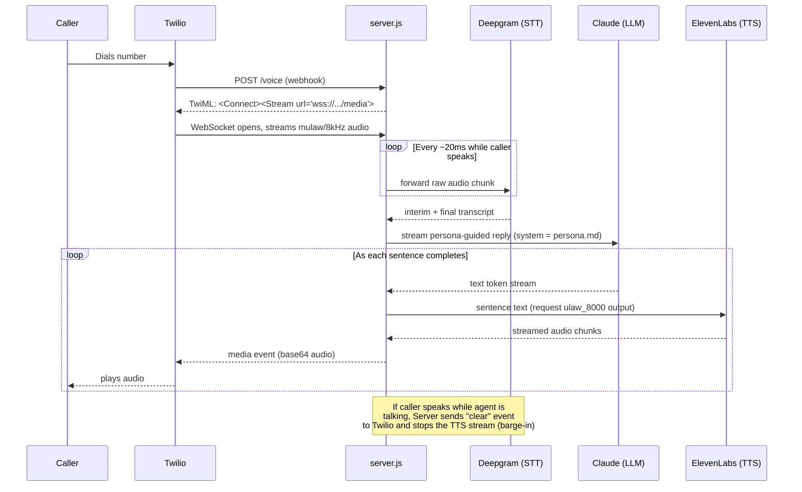

# Architecture

## Why no audio conversion happens anywhere

| Hop | Format | Notes |
|---|---|---|
| Caller → Twilio | mulaw, 8kHz | Standard telephony codec |
| Twilio → Server | mulaw, 8kHz, base64 over WebSocket | Passed straight through |
| Server → Deepgram | mulaw, 8kHz | Deepgram accepts this natively (`encoding: "mulaw"`) |
| ElevenLabs → Server | `ulaw_8000` | Requested explicitly in the TTS API call |
| Server → Twilio → Caller | mulaw, 8kHz | Passed straight through |

Every conversion step skipped is latency saved. This is the main reason the pipeline can hit
sub-second response times on modest hosting.

## Barge-in mechanism

`agentSpeaking` is a per-call boolean flag:
- Set `true` the moment Claude starts generating a reply.
- Checked before every chunk sent to ElevenLabs and before every audio chunk relayed to Twilio.
- Set `false` the instant Deepgram reports the caller speaking mid-reply, which also fires a
  Twilio `clear` event to flush any audio Twilio has already buffered for playback.

This is what makes interrupting the agent behave like interrupting a person, rather than talking
over a pre-recorded message.
